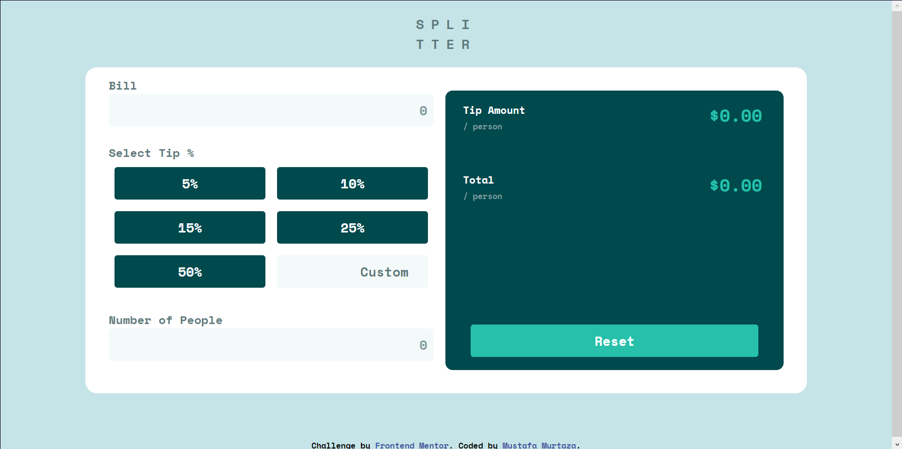

# Frontend Mentor - Tip calculator app solution

This is a solution to the [Tip calculator app challenge on Frontend Mentor](https://www.frontendmentor.io/challenges/tip-calculator-app-ugJNGbJUX). Frontend Mentor challenges help you improve your coding skills by building realistic projects.

## Table of contents

- [Overview](#overview)
  - [The challenge](#the-challenge)
  - [Screenshot](#screenshot)
- [My process](#my-process)
  - [Built with](#built-with)
  - [What I learned](#what-i-learned)
- [Acknowledgments](#acknowledgments)

## Overview
Create a Tip app that calculates the tip and displays the tip amount and total amount per person
### The challenge

Users should be able to:

- View the optimal layout for the app depending on their device's screen size
- See hover states for all interactive elements on the page
- Calculate the correct tip and total cost of the bill per person

### Screenshot

## My process
i Started with building the design first then went to js to ass the functionality. i started with getting the input values and using them and the buttons value to calculate the tip and total cost per person. i then worked on the reset functionality where i set everything to default
### Built with

- Semantic HTML5 markup
- CSS custom properties
- Flexbox
- CSS Grid
- Mobile-first workflow

### What I learned
Learned more about grid and flex layouts.

## Acknowledgments

Great thanks for chatGPT on its help with some technical areas.
